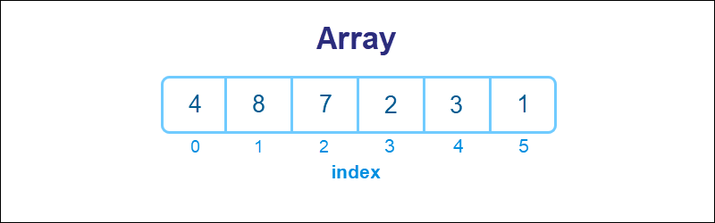

# Study Note: Array

## Description  

Array: A contiguous block of memory that stores elements of the same data type. Arrays provide O(1) random access to elements by index, but insertion and deletion operations in the middle are costly O(n) due to the need to shift elements.

## Visualization  

## Abstract Data Type

An array is an abstract data type (ADT) that represents a collection of elements, each identified by at least one array index or key. The array ADT supports the following operations:

- **Access**: Retrieve the value of an element at a specific index. Time complexity: O(1).
- **Update**: Modify the value of an element at a specific index. Time complexity: O(1).
- **Insert**: Add an element at a specific position, shifting subsequent elements. Time complexity: O(n).
- **Delete**: Remove an element at a specific position, shifting subsequent elements. Time complexity: O(n).
- **Traversal**: Visit each element in the array sequentially. Time complexity: O(n).

Arrays are widely used due to their simplicity and efficiency in accessing elements by index.

## Time Complexity

Let `n` be the number of elements in the array.

### Basic Operations

| Operation | Description | Time Complexity |
|---------|------------|----------------|
| Access | Read element by index | O(1) |
| Update | Write element by index | O(1) |
| Traversal | Visit all elements | O(n) |

---

### Search

| Array Type | Search Method | Time Complexity |
|-----------|--------------|----------------|
| Unsorted Array | Linear Search | O(n) |
| Sorted Array | Binary Search | O(log n) |

---

### Insert

| Position | Condition | Time Complexity |
|--------|----------|----------------|
| End | Capacity available (dynamic array) | Amortized O(1) |
| End | Reallocation required | O(n) |
| Beginning / Middle | Elements must be shifted | O(n) |

---

### Delete

| Position | Condition | Time Complexity |
|--------|----------|----------------|
| End | No shifting required | O(1) |
| Beginning / Middle | Elements must be shifted | O(n) |

---

## Space Complexity

| Item | Space Complexity | Description |
|----|-----------------|------------|
| Element Storage | O(n) | Space to store `n` elements |
| Auxiliary Space | O(1) | Extra space for typical operations |
| Dynamic Array Extra Capacity | O(n) | Allocated but unused capacity |
| Resizing (`realloc`) | O(1) – O(n) | Depends on whether reallocation occurs |

---

## Conclusion

Arrays provide extremely fast access and update operations with constant time complexity O(1).  
They are well-suited for scenarios where data size is fixed or when read operations dominate.

However, insertion and deletion operations—especially at the beginning or middle of the array—are costly due to the need to shift elements, resulting in O(n) time complexity.

For static datasets or read-heavy workloads, arrays combined with binary search are highly efficient.  
For applications requiring frequent insertions and deletions, other data structures such as linked lists or trees may be more appropriate.

---

