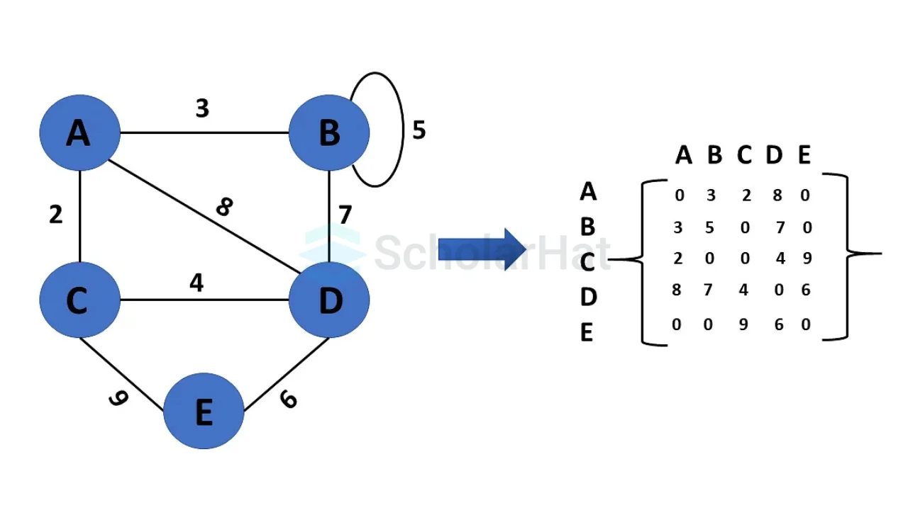

# Study Note: Graph

## Description

Graph: A collection of **vertices (nodes)** connected by **edges** that model relationships between entities. Edges can be **undirected** (two-way) or **directed** (one-way), and graphs may contain **cycles** (unlike trees). Graphs are commonly used to represent real-world networks such as social connections, transportation routes, and hyperlinks on the web.  

## Graph in Discrete Mathematics

In **discrete mathematics**, a graph is defined formally as an ordered pair:

- **Undirected graph**: \(G = (V, E)\)  
    - \(V\): a **non-empty finite set** of vertices  
    - \(E \subseteq \{\{u,v\} \mid u,v \in V,\ u \neq v\}\): a set of **unordered pairs** (edges)

- **Directed graph (digraph)**: \(G = (V, E)\)  
    - \(E \subseteq V \times V\): a set of **ordered pairs** \((u,v)\) (arcs)

### Key terms
- **Adjacent vertices**: \(u\) and \(v\) are adjacent if \(\{u,v\} \in E\) (undirected) or \((u,v) \in E\) (directed)
- **Degree** (undirected): \($\deg$(v)\) = number of edges incident to \(v\)  
    **In-degree / Out-degree** (directed): \($\deg$^{-}(v)\), \($\deg^{+}(v)\)
- **Walk / Trail / Path**:
    - **Walk**: sequence of vertices where consecutive vertices are connected by edges
    - **Trail**: walk with no repeated edges
    - **Path**: walk with no repeated vertices
- **Cycle**: a path that starts and ends at the same vertex (length \($\ge$ 1\))
- **Simple graph**: no loops and no multiple edges  
    **Multigraph**: may contain multiple edges between the same vertices  
    **Pseudograph**: may contain loops

### Handshaking Lemma (undirected)
\[
$\sum_{v \in V} \deg(v) = 2|E|$
\]  
A consequence: the number of vertices with **odd degree** is **even**.

## Visualization


```

## Representation
- **Adjacency Matrix**: 2D array where matrix[i][j] indicates edge between vertex i and j
- **Adjacency List**: Array of linked lists, each list contains neighbors of a vertex
- **Edge List**: List of all edges as pairs of vertices

## Abstract Data Type
A graph can be represented as an Abstract Data Type (ADT) with the following operations:

- **Create**: Initialize an empty graph (optionally specify directed/undirected, weighted/unweighted).
- **Add Vertex**: Add a new vertex to the graph.
- **Add Edge**: Add an edge between two vertices (optionally with a weight/cost; direction depends on graph type).
- **Remove Vertex**: Remove a vertex and all incident edges.
- **Remove Edge**: Remove the edge between two vertices.
- **Get Neighbors**: Return the set/list of vertices adjacent to a given vertex (out-neighbors for directed graphs).
- **Has Edge**: Check whether an edge exists between two vertices.
- **Get Vertices**: Return all vertices currently in the graph.
- **Get Edges (optional)**: Return all edges currently in the graph.

These operations support building and querying graphs independently of the underlying representation (adjacency matrix, adjacency list, or edge list).

## Complexity
## Time Complexity

| Operation | Adjacency Matrix | Adjacency List |
|---------|-----------------|----------------|
| Check if edge (u, v) exists | O(1) | O(deg(u)) |
| Iterate neighbors of u | O(V) | O(deg(u)) |
| Add edge | O(1) | O(1) |
| Remove edge | O(1) | O(deg(u)) |
| BFS / DFS | O(V²) | O(V + E) |

**Key Insight:**  
- Adjacency matrices excel at **constant-time edge existence checks**.
- Adjacency lists are more efficient for **graph traversal and sparse graphs**.

---

## Space Complexity

| Aspect | Adjacency Matrix | Adjacency List |
|-----|-----------------|----------------|
| Storage | O(V²) | O(V + E) |
| Memory efficiency | Poor for sparse graphs | Efficient for sparse graphs |
| Cache locality | Very good | Moderate |

**Key Insight:**  
- Adjacency matrices waste space when the graph has few edges.
- Adjacency lists scale well as the number of edges grows.

## Practical Trade-offs

### Adjacency Matrix
**Advantages**
- Simple representation
- Fast edge existence queries
- Good cache performance

**Disadvantages**
- High memory cost
- Inefficient neighbor iteration

---

### Adjacency List
**Advantages**
- Memory efficient
- Fast graph traversal (BFS / DFS)
- Easy to store edge weights

**Disadvantages**
- Slower edge existence checks
- Slightly more complex structure

---

## Typical Applications

| Application | Preferred Representation | Reason |
|-----------|--------------------------|--------|
| Dense graphs | Adjacency Matrix | Many edges, space not wasted |
| Small graphs | Adjacency Matrix | Simplicity |
| Sparse graphs | Adjacency List | Lower memory usage |
| Social networks | Adjacency List | Few connections per node |
| Road networks | Adjacency List | Efficient traversal |
| Graph algorithms (BFS, DFS, Dijkstra) | Adjacency List | O(V + E) performance |

---

## Conclusion

- **Adjacency Matrix** is best when the graph is **dense**, small, or requires frequent edge existence checks.
- **Adjacency List** is the preferred choice for **large, sparse graphs** and most real-world applications.

In practice, adjacency lists are far more common due to their **space efficiency and traversal performance**, while adjacency matrices remain useful in specialized or small-scale scenarios.

---

## Variations
- **Directed vs Undirected**: edges have direction (arcs) or not.
- **Weighted vs Unweighted**: edges (or vertices) carry costs/weights.
- **Simple graph / Multigraph / Pseudograph**: no parallel edges/loops vs allowing them.
- **Connected vs Disconnected**: all vertices mutually reachable vs multiple components.
- **Cyclic vs Acyclic**:
    - **DAG** (Directed Acyclic Graph): used in scheduling, dependencies, compilers.
- **Complete graph** \(K_n\): every pair of distinct vertices is connected.
- **Bipartite graph**: vertices split into two sets; edges go only across sets (used in matching).
- **Planar graph**: drawable without edge crossings.
- **Tree / Forest**: connected acyclic undirected graph / collection of trees.
- **Special forms**: grid graphs, random graphs, hypergraphs (edges can connect > 2 vertices).
