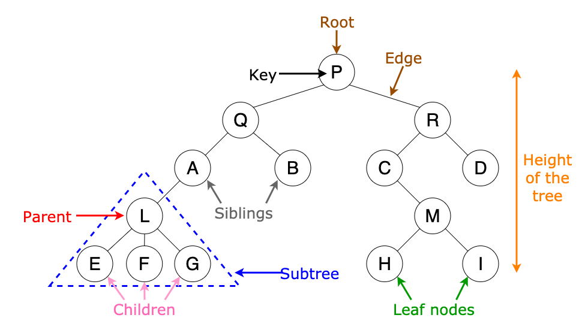

# Study Note: Tree

## Description

A Tree is a non-linear hierarchical data structure consisting of connected nodes without cycles. Each node may have zero or more children, forming parent–child relationships, and the entire structure represents hierarchical data (file systems, organization charts, decision models).

## Visualization

## Abstract Data Type

**Binary Tree Operations:**
- `Create()`: create an empty binary tree
- `IsEmpty(bt)`: true if bt is empty
- `MakeBT(bt1, item, bt2)`: construct a new binary tree with left subtree bt1, item as root, right subtree bt2
- `Lchild(bt)`: return left subtree
- `Rchild(bt)`: return right subtree
- `Data(bt)`: return item at root

**Implementation Approaches:**
1. **Pointer-based representation** (common for BST)
2. **Array-based representation** (heaps, complete trees)
3. **Left Child–Right Sibling Representation** (general trees)

**Traversal Algorithms:**
- Preorder (root-left-right)
- Inorder (left-root-right)
- Postorder (left-right-root)
- Level-order (BFS with queue)

## Time Complexity 

| Operation | Pointer-based (BST) | Array-based (Heap / Complete Tree) |
|---------|--------------------|------------------------------------|
| Access node by index | O(n) | O(1) |
| Search | O(h) (avg O(log n), worst O(n)) | O(n) |
| Insert | O(h) | O(log n) |
| Delete | O(h) | O(log n) |
| Find min / max | O(h) | O(1) / O(n)\* |
| Traversal (DFS) | O(n) | O(n) |

\* In a heap, **min (min-heap) or max (max-heap)** is at index 0.

---

## Space Complexity 

| Aspect | Pointer-based | Array-based |
|------|--------------|-------------|
| Total storage | O(n) | O(n) |
| Per-node overhead | O(1) (child pointers) | O(1) (no pointers) |
| Memory locality | Poor | Excellent |
| Wasted space | None | Possible (if array resized) |

**Key Insight**
- Pointer-based trees pay extra space for pointers.
- Array-based trees save pointer space but require structural constraints.

---

## Structural Constraints

| Feature | Pointer-based | Array-based |
|------|--------------|-------------|
| Tree shape | Arbitrary | Must be complete |
| Balancing | Optional (AVL, Red-Black) | Implicit |
| Dynamic resizing | Easy | Costly (array resize) |

---

## Typical Applications

### Pointer-based Representation
**Use when structure is flexible**
- Binary Search Tree (BST)
- AVL Tree
- Red-Black Tree
- Expression trees
- File system directory trees

**Why**
- Efficient ordered search
- Flexible insertions and deletions
- Supports in-order traversal

---

### Array-based Representation
**Use when tree is complete**
- Binary Heap (priority queue)
- Heap sort
- Scheduling systems
- Dijkstra’s algorithm (priority queue)
- Event simulation systems

**Why**
- Fast parent/child access using indices
- No pointer overhead
- Cache-friendly

---

## Final Takeaway

- **Pointer-based trees** are ideal for **search-oriented and ordered data structures**, especially when the tree shape is dynamic.
- **Array-based trees** are best for **complete trees** where fast index access and memory efficiency matter.
